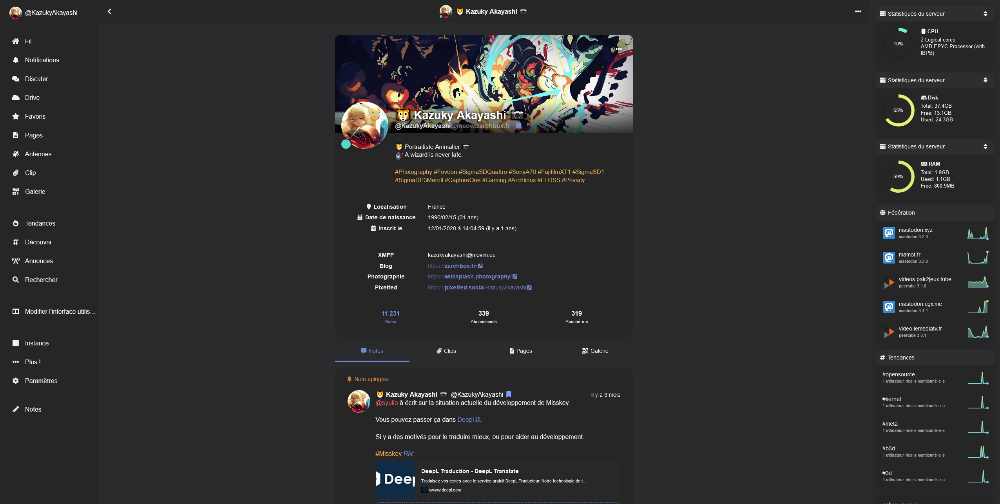

# Misskey-Discord-theme
 Discord color theme for Misskey

 ## Use

Copy this code on misskey theme editor :

```
{
	id: '27dm86qf-bv85-930e-919f-f23bhg996cab',
	base: 'dark',
	desc: 'Discord color theme',
	name: 'Discord',
	props: {
		bg: '#2a2b2d',
		fg: '#f2f2f2',
		link: '#7289da',
		badge: '#7f9bff',
		navBg: '@panel',
		navFg: '@fg',
		panel: '#262626',
		accent: '#7086d6',
		header: 'rgba(38, 38, 38,0.75)',
		pageBg: '@bg',
 		renote: '#7086d6',
		divider: 'rgba(42, 43, 45, 0.7)',
		hashtag: '#f0ad4e',
		mention: '#f05c5c',
		navActive: '#7086d6',
		navHoverFg: '#7086d6',
		navIndicator: '@accent',
		driveFolderBg: '@panel',
		fgHighlighted: '@accent',
 		infoWarnBg: '#ECD379',
		infoWarnFg: '#2e3440',
	},
	author: 'KazukyAkayashi',
}
```

## In Stylus or Misskey CSS editor

```
/* bg for link preview */
.mk-url-preview > a > article {
    /*background-color: #2f2f40 ;*/
    background-color: rgba(42, 43, 45, 0.50);
}
```

## Screenshot

